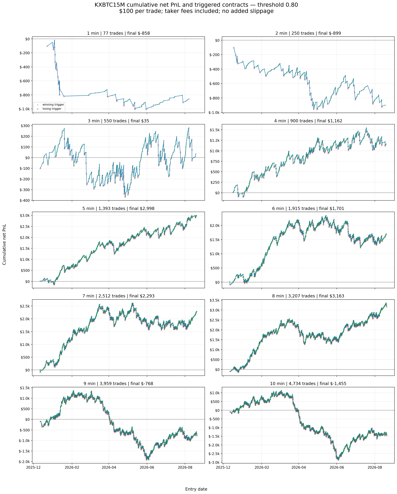

# KXBTC15M favorite–longshot bias study

This repository contains a research-only backtest of one threshold (`0.80`) on Kalshi's 15-minute Bitcoin markets. It contains no order-routing code, credentials, or live/paper-trading state.

## Motivation

The question is whether traders systematically **overbet low-probability outcomes**. If that favorite–longshot bias exists, the market-implied favorite should be underpriced, so buying it after a sustained `> 80:20` imbalance should earn a positive fee-adjusted return.

## Strategy

For every settled KXBTC15M market and each observation window from 1 to 10 minutes:

1. Treat the latest traded YES/NO prices as constant until the next trade.
2. Trigger only if either side remains strictly above `0.80` for strictly more than half of the observation window.
3. At the first trade at or after the observation window, buy whichever side then has the higher probability.
4. Bet a fixed `$100` per signal, with no compounding.
5. Model every entry as a taker order and deduct the historical taker fee.

The headline model fills the full `$100` at the next public trade with no added slippage. The full result table also reports `+1¢`/`+2¢` slippage and a conservative capacity filter that requires the observed trade size to cover the order. Exact 50/50 entries resolve to YES to reproduce the archived experiment; this occurs in 7 of 19,497 signal rows.

## Results

The source universe contains 23,462 finalized markets from 2025-12-10 through 2026-08-19. The headline figures below use the next-trade taker model, zero added slippage, fixed `$100` stakes, and fees included.

| Window / period | Trades | Net PnL | Net ROI | Reading |
|---|---:|---:|---:|---|
| 5 min, full sample | 1,393 | +$2,998.22 | +2.137% | Supports the low-probability-overbet hypothesis in aggregate |
| 10 min, full sample | 4,734 | -$1,454.87 | -0.306% | No stable full-sample edge |
| 10 min, available 2025 slice | 174 | +$236.96 | +1.354% | Positive point estimate; only Dec 12–31, so not a full year |
| 10 min, through Feb 2026 | 1,319 | +$1,013.52 | +0.765% | Early period supports the hypothesis |
| 10 min, Mar–May 2026 | 1,865 | -$3,789.26 | -2.025% | Reversal consistent with systematic overpricing of the favorite |
| 10 min, Jun–Jul 20 2026 | 1,001 | +$1,426.89 | +1.421% | The edge rebounds; the reversal is not permanent |
| 10 min, latest 30 data days | 549 | -$106.02 | -0.192% | Signals still trigger, but net performance is near-zero noise |

So the compact answer is: **5 minutes: yes, in aggregate. 10 minutes: regime-dependent.** The short 2025 slice was positive, March–May 2026 flipped into favorite overpricing, June to mid-July recovered, and the latest 30 days had no detectable post-fee direction. “No signal” here means no useful edge—not no triggers.

The 5-minute result is execution-sensitive: at `+1¢` and `+2¢` assumed slippage, net PnL falls to `+$1,512.59` and `+$72.71`. Under the observed-trade-capacity filter, only 103 zero-slippage entries remain, with `+$130.01` net PnL. These are exploratory backtests, not evidence that the quoted fills could have been obtained live.



## Repository contents

- `study.py` — signal definition, fee/PnL calculation, summaries, verification, and plot generation.
- `results/threshold_080_signals.parquet` — 19,497 processed threshold-0.80 signals across 4,960 unique markets.
- `results/threshold_080_ladder_summary.csv` — all 60 window/fill/slippage combinations.
- `results/threshold_080_key_results.csv` — the headline and descriptive regime slices above.
- `figures/threshold_080_pnl_and_triggers.png` — full-period trigger distribution over cumulative PnL.
- `SHA256SUMS` — checksums for the published data and figure artifacts.

Only the `0.80` experiment is published. The 0.70/0.90 runs, duplicate exports, raw 8.8 GiB trade archive, scraper logs, notebooks, and the abandoned trading automation are intentionally excluded.

## Reproduce

Python 3.13 was used for the archived run.

```bash
python -m venv .venv
# Activate .venv for your shell, then run:
python -m pip install -r requirements.txt
python -m unittest discover -s tests
python study.py --verify
python study.py --write
```

`--verify` recomputes the 60-row ladder table from the committed signal-level Parquet and compares it with the published CSV. `--write` regenerates both CSV summaries and the figure. Rebuilding the signal Parquet from raw market trades is outside this compact repository; `extract_signal()` preserves the per-market rule for that purpose.

## Limitations

- The data ends on 2026-08-19 and does not include Aug 20–30.
- The 2025 result is a short December slice, not a yearly estimate.
- Parameter windows were inspected retrospectively; there is no untouched out-of-sample period.
- The next public trade is only a taker-fill proxy. Queueing, depth, latency, and market impact are not reconstructed.
- Regime labels are descriptive boundaries selected after viewing the PnL path; they should not be interpreted as a predictive regime detector.
- This is research, not financial advice or a deployable trading strategy.
